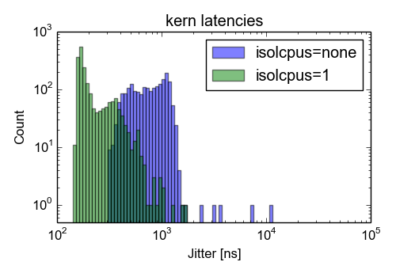
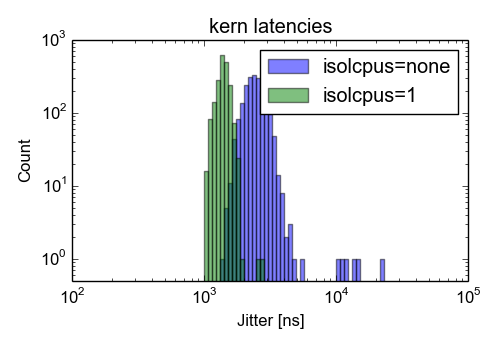

# abbott: rtai-5.1 on 4.4.115 linux kernel

tested on 2018-06-14

## RTAI-patched linux kernel and machine

Linux kernel version *4.4.115* patched with *hal-linux-4.4.115-x86-10.patch* of *rtai-5.1*: [kernel configuration](config-4.4.115-rtai-5.1-abbott-090-2018-06-14-polltscrel-plain-cpu1-idle-ok)

*Intel(R) Core(TM) i5-6600K CPU @ 3.50GHz* on a *ASUSTeK Z170-K* motherboard (version *COMPUTER INC. Rev X.0x*)

## Performance

kern/latency test for 1988 seconds.
Reported is the mean, standard deviation and the maximum value of the jitter (`lat max - lat min`) in nanoseconds.

### Idle machine

[kernel configuration](config-4.4.115-rtai-5.1-abbott-090-2018-06-14-polltscrel-plain-cpu1-idle-ok)

Kernel parameter:
* idle=poll
* tsc=reliable
* isolcpus=1

| isolcpus | mean | stdev | max   | link                                                                                                    |
|----------|------------:|------:|------:|---------------------------------------------------------------------------------------------------------|
| none     |         797 |   396 | 10808 | [test details](latencies-4.4.115-rtai-5.1-abbott-090-2018-06-14-polltscrel-plain-cpu1-idle-ok)          |
| 1        |         231 |   122 |  1713 | [test details](latencies-4.4.115-rtai-5.1-abbott-092-2018-06-14-polltscrel-isolcpus1-cpu1-idle-perfect) |

### Full load

[kernel configuration](config-4.4.115-rtai-5.1-abbott-091-2018-06-14-polltscrel-plain-cpu1-cimn-bad)

Kernel parameter:
* idle=poll
* tsc=reliable
* isolcpus=1

| isolcpus | mean | stdev | max   | link                                                                                                 |
|----------|------------:|------:|------:|------------------------------------------------------------------------------------------------------|
| none     |        2471 |   811 | 23088 | [test details](latencies-4.4.115-rtai-5.1-abbott-091-2018-06-14-polltscrel-plain-cpu1-cimn-bad)      |
| 1        |        1397 |   145 |  2831 | [test details](latencies-4.4.115-rtai-5.1-abbott-093-2018-06-14-polltscrel-isolcpus1-cpu1-cimn-good) |

