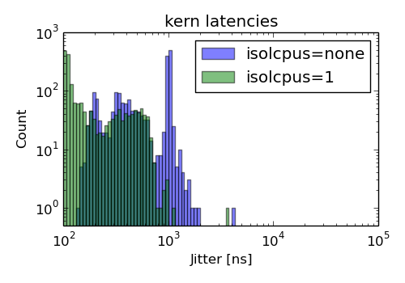
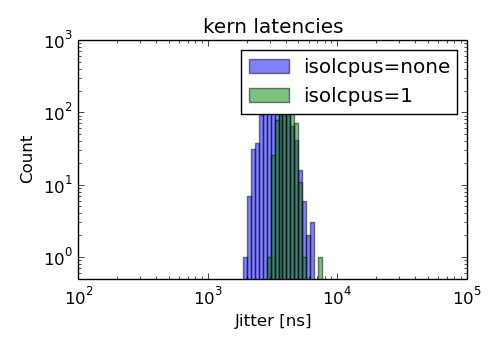

# horse: rtai-5.2 on 4.4.176 linux kernel

tested on 2019-06-18

## Machine

Linux kernel version *4.4.176* patched with *hal-linux-4.4.176-x86-14.patch* of *rtai-5.2*

*Intel(R) Core(TM) i7-3770 CPU @ 3.40GHz* on a *FUJITSU D3161-A1* motherboard (version *S26361-D3161-A1*)

## Kernel parameter:
* idle=poll
* tsc=reliable

## Performance

kern/latency test for 1983 seconds.
Reported is the mean, standard deviation and the maximum value of the jitter (`lat max - lat min`) in nanoseconds.

### Idle machine

| isolcpus | mean | stdev | max  |
|----------|------------:|------:|-----:|
| none     |         673 |   356 | 4043 |
| 1        |         218 |   182 | 3680 |

### Full load

| isolcpus | mean | stdev | max  |
|----------|------------:|------:|-----:|
| none     |        3428 |   606 | 6501 |
| 1        |        4019 |   346 | 7519 |

