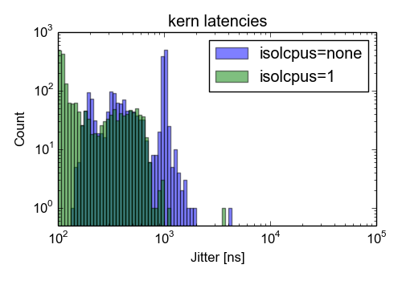
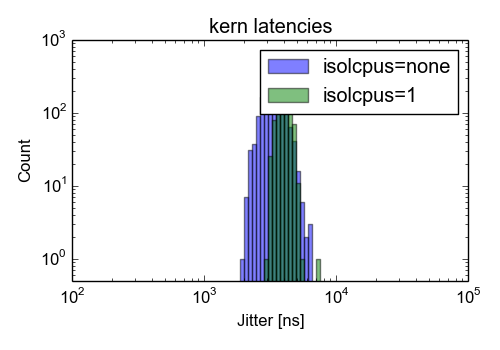

# horse: rtai-5.2 on 4.4.176 linux kernel

tested on 2019-06-18

## Kernel and machine

Linux kernel version *4.4.176* patched with *hal-linux-4.4.176-x86-14.patch* of *rtai-5.2*: [kernel configuration](config-horse-rtai-5.2-4.4.176-039-2019-06-18-poll-tscreliable-plain-cpu1-idle-perfect)

*Intel(R) Core(TM) i7-3770 CPU @ 3.40GHz* on a *FUJITSU D3161-A1* motherboard (version *S26361-D3161-A1*)

## Kernel parameter:
* idle=poll
* tsc=reliable

## Performance

kern/latency test for 1983 seconds.
Reported is the mean, standard deviation and the maximum value of the jitter (`lat max - lat min`) in nanoseconds.

### Idle machine

| isolcpus | mean | stdev | max  | link                                                                                                      |
|----------|------------:|------:|-----:|-----------------------------------------------------------------------------------------------------------|
| none     |         673 |   356 | 4043 | [test details](latencies-horse-rtai-5.2-4.4.176-039-2019-06-18-poll-tscreliable-plain-cpu1-idle-perfect)  |
| 1        |         218 |   182 | 3680 | [test details](latencies-horse-rtai-5.2-4.4.176-041-2019-06-18-poll-tscreliable-isolcpus1-cpu1-idle-good) |

### Full load

| isolcpus | mean | stdev | max  | link                                                                                                      |
|----------|------------:|------:|-----:|-----------------------------------------------------------------------------------------------------------|
| none     |        3428 |   606 | 6501 | [test details](latencies-horse-rtai-5.2-4.4.176-040-2019-06-18-poll-tscreliable-plain-cpu1-cimn-good)     |
| 1        |        4019 |   346 | 7519 | [test details](latencies-horse-rtai-5.2-4.4.176-042-2019-06-18-poll-tscreliable-isolcpus1-cpu1-cimn-good) |

