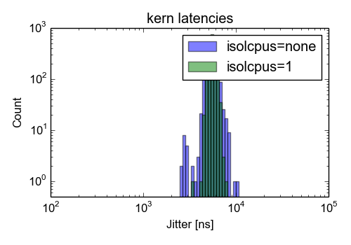

# mule: rtai-5.1 on 4.4.115 linux kernel

tested on 2018-06-14

## Machine

Linux kernel version *4.4.115* patched with *hal-linux-4.4.115-x86-10.patch* of *rtai-5.1*

*Intel(R) Core(TM) i5-3570 CPU @ 3.40GHz* on a *FUJITSU D3162-A1* motherboard (version *S26361-D3162-A1*)

## Kernel parameter:
* idle=poll
* tsc=reliable

## Performance

kern/latency test for 1988 seconds.
Reported is the mean, standard deviation and the maximum value of the jitter (`lat max - lat min`) in nanoseconds.

### Idle machine

| isolcpus | mean | stdev | max  |
|----------|------------:|------:|-----:|
| none     |         537 |   239 | 4322 |
| 1        |         252 |   196 | 4476 |

\

### Full load

| isolcpus | mean | stdev | max   |
|----------|------------:|------:|------:|
| none     |        5539 |   737 | 10272 |
| 1        |        5567 |   426 |  7839 |

\

